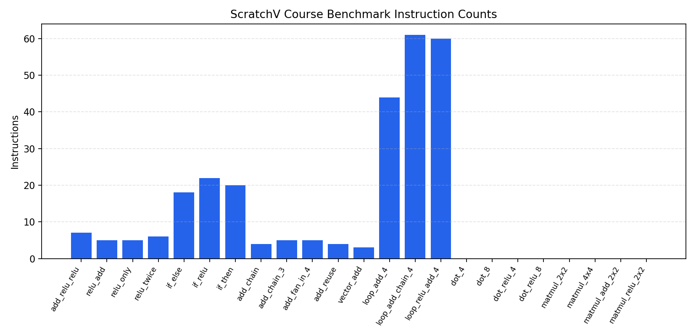

# ScratchV DSL 编译器性能测试报告

## 测试概览

- Schema 版本: 2
- 运行模式: benchmark
- 类别筛选: null
- 名称筛选: null
- 生成时间: 2026-09-14 22:48:51
- 用例总数: 23
- 通过数量: 12
- 失败数量: 11
- 通过率: 52.2%
- 测试目录: `tests/topic06/cases`
- 汇编输出目录: `build/topic06`
- 性能基线文件: `benchmarks/topic06/baseline.json`
- 性能退化阈值: 5.00%
- 单次编译超时: 30s
- 单次模拟超时: 5s

## 测试结果

| 用例 | 类别 | 状态 | 编译返回码 | 编译日志 | 模拟后端 | 指令数 | Benchmark 次数 | Benchmark 停止原因 | 平均指令数 | 95% 置信区间 | 最小 | 最大 | 编译耗时(s) | 模拟耗时(s) | 总耗时(s) | 基线 | 变化量 | 变化率(%) | 退化阈值(%) | 是否退化 | 预期输出 | TinyFive 输出 | 输出匹配 | 汇编文件 |
|---|---|---|---:|---|---|---:|---:|---|---:|---:|---:|---:|---:|---:|---:|---:|---:|---:|---:|---|---|---|---|---|
| add_relu_relu | activation | PASS | 0 | null | tinyfive | 7 | 3 | null | 7.00 | ±0.00 | 7 | 7 | 0.0851 | 0.1467 | 0.8290 | 7.00 | 0.00 | 0.00 | 5.00 | False | 7 | 7 | True | build/topic06/add_relu_relu.s |
| relu_add | activation | PASS | 0 | null | tinyfive | 5 | 3 | null | 5.00 | ±0.00 | 5 | 5 | 0.0879 | 0.1541 | 0.8029 | 5.00 | 0.00 | 0.00 | 5.00 | False | 3 | 3 | True | build/topic06/relu_add.s |
| relu_only | activation | PASS | 0 | null | tinyfive | 5 | 3 | null | 5.00 | ±0.00 | 5 | 5 | 0.0860 | 0.1545 | 0.8123 | 5.00 | 0.00 | 0.00 | 5.00 | False | 0 | 0 | True | build/topic06/relu_only.s |
| relu_twice | activation | PASS | 0 | null | tinyfive | 6 | 3 | null | 6.00 | ±0.00 | 6 | 6 | 0.0864 | 0.1509 | 0.8119 | 6.00 | 0.00 | 0.00 | 5.00 | False | 4 | 4 | True | build/topic06/relu_twice.s |
| if_else | branch | FAIL | 0 | null | timeout | 0 | 0 | benchmark skipped: initial simulation timeout | null | null | null | null | 0.0877 | 5.0240 | 5.1174 | null | null | null | 5.00 | null | 5 | None | False | build/topic06/if_else.s |
| if_relu | branch | FAIL | 0 | null | timeout | 0 | 0 | benchmark skipped: initial simulation timeout | null | null | null | null | 0.0959 | 5.0234 | 5.1205 | null | null | null | 5.00 | null | 0 | None | False | build/topic06/if_relu.s |
| if_then | branch | FAIL | 0 | null | timeout | 0 | 0 | benchmark skipped: initial simulation timeout | null | null | null | null | 0.0892 | 5.0158 | 5.1061 | null | null | null | 5.00 | null | 13 | None | False | build/topic06/if_then.s |
| add_chain | elementwise | PASS | 0 | null | tinyfive | 4 | 3 | null | 4.00 | ±0.00 | 4 | 4 | 0.0876 | 0.1568 | 0.8241 | 4.00 | 0.00 | 0.00 | 5.00 | False | 9 | 9 | True | build/topic06/add_chain.s |
| add_chain_3 | elementwise | PASS | 0 | null | tinyfive | 5 | 3 | null | 5.00 | ±0.00 | 5 | 5 | 0.0856 | 0.1468 | 0.8015 | 5.00 | 0.00 | 0.00 | 5.00 | False | 14 | 14 | True | build/topic06/add_chain_3.s |
| add_fan_in_4 | elementwise | PASS | 0 | null | tinyfive | 5 | 3 | null | 5.00 | ±0.00 | 5 | 5 | 0.0850 | 0.1628 | 0.8475 | 5.00 | 0.00 | 0.00 | 5.00 | False | 10 | 10 | True | build/topic06/add_fan_in_4.s |
| add_reuse | elementwise | PASS | 0 | null | tinyfive | 4 | 3 | null | 4.00 | ±0.00 | 4 | 4 | 0.1064 | 0.1612 | 0.8810 | 4.00 | 0.00 | 0.00 | 5.00 | False | 10 | 10 | True | build/topic06/add_reuse.s |
| vector_add | elementwise | PASS | 0 | null | tinyfive | 3 | 3 | null | 3.00 | ±0.00 | 3 | 3 | 0.0854 | 0.1476 | 0.8187 | 3.00 | 0.00 | 0.00 | 5.00 | False | 5 | 5 | True | build/topic06/vector_add.s |
| loop_add_4 | loop | PASS | 0 | null | tinyfive | 22 | 3 | null | 22.00 | ±0.00 | 22 | 22 | 0.0913 | 0.1559 | 0.7475 | 22.00 | 0.00 | 0.00 | 5.00 | False | 5 | 5 | True | build/topic06/loop_add_4.s |
| loop_add_chain_4 | loop | PASS | 0 | null | tinyfive | 26 | 3 | null | 26.00 | ±0.00 | 26 | 26 | 0.0866 | 0.1573 | 0.7031 | 26.00 | 0.00 | 0.00 | 5.00 | False | 9 | 9 | True | build/topic06/loop_add_chain_4.s |
| loop_relu_add_4 | loop | PASS | 0 | null | tinyfive | 30 | 3 | null | 30.00 | ±0.00 | 30 | 30 | 0.0855 | 0.1567 | 0.7070 | 30.00 | 0.00 | 0.00 | 5.00 | False | 2 | 2 | True | build/topic06/loop_relu_add_4.s |
| dot_4 | reduction | FAIL | 0 | null | tinyfive | 3 | 0 | benchmark skipped: TinyFive input ABI unsupported | null | null | null | null | 0.0858 | 0.1493 | 0.3609 | null | null | null | 5.00 | null | 70 | 0 | False | build/topic06/dot_4.s |
| dot_8 | reduction | FAIL | 0 | null | tinyfive | 3 | 0 | benchmark skipped: TinyFive input ABI unsupported | null | null | null | null | 0.0836 | 0.1503 | 0.3586 | null | null | null | 5.00 | null | 36 | 0 | False | build/topic06/dot_8.s |
| dot_relu_4 | reduction | FAIL | 0 | null | tinyfive | 5 | 0 | benchmark skipped: TinyFive input ABI unsupported | null | null | null | null | 0.0843 | 0.1484 | 0.3574 | null | null | null | 5.00 | null | 0 | 0 | True | build/topic06/dot_relu_4.s |
| dot_relu_8 | reduction | FAIL | 0 | null | tinyfive | 5 | 0 | benchmark skipped: TinyFive input ABI unsupported | null | null | null | null | 0.0883 | 0.1534 | 0.3687 | null | null | null | 5.00 | null | 8 | 0 | False | build/topic06/dot_relu_8.s |
| matmul_2x2 | tensor | FAIL | 0 | null | tinyfive | 3 | 0 | benchmark skipped: TinyFive input ABI unsupported | null | null | null | null | 0.0863 | 0.1575 | 0.3701 | null | null | null | 5.00 | null | [[19, 22], [43, 50]] | 0 | False | build/topic06/matmul_2x2.s |
| matmul_4x4 | tensor | FAIL | 0 | null | tinyfive | 3 | 0 | benchmark skipped: TinyFive input ABI unsupported | null | null | null | null | 0.0879 | 0.1479 | 0.3601 | null | null | null | 5.00 | null | [[1, 2, 3, 4], [5, 6, 7, 8], [9, 10, 11, 12], [13, 14, 15, 16]] | 0 | False | build/topic06/matmul_4x4.s |
| matmul_add_2x2 | tensor | FAIL | 0 | null | tinyfive | 4 | 0 | benchmark skipped: TinyFive input ABI unsupported | null | null | null | null | 0.0843 | 0.1579 | 0.3648 | null | null | null | 5.00 | null | [[20, 23], [44, 51]] | 0 | False | build/topic06/matmul_add_2x2.s |
| matmul_relu_2x2 | tensor | FAIL | 0 | null | tinyfive | 5 | 0 | benchmark skipped: TinyFive input ABI unsupported | null | null | null | null | 0.0851 | 0.1587 | 0.3723 | null | null | null | 5.00 | null | [[0, 2], [0, 4]] | 0 | False | build/topic06/matmul_relu_2x2.s |

## 双后端能力矩阵

| 用例 | 类别 | DSLInterpreter | TinyFive | TinyFive 失败类型 | 两后端输出一致 | 单用例报告 |
|---|---|---|---|---|---|---|
| add_relu_relu | activation | PASS | PASS | null | True | benchmark_reports/topic06/cases/activation-add_relu_relu.md |
| relu_add | activation | PASS | PASS | null | True | benchmark_reports/topic06/cases/activation-relu_add.md |
| relu_only | activation | PASS | PASS | null | True | benchmark_reports/topic06/cases/activation-relu_only.md |
| relu_twice | activation | PASS | PASS | null | True | benchmark_reports/topic06/cases/activation-relu_twice.md |
| if_else | branch | UNSUPPORTED | TIMEOUT | simulation_timeout | null | benchmark_reports/topic06/cases/branch-if_else.md |
| if_relu | branch | UNSUPPORTED | TIMEOUT | simulation_timeout | null | benchmark_reports/topic06/cases/branch-if_relu.md |
| if_then | branch | UNSUPPORTED | TIMEOUT | simulation_timeout | null | benchmark_reports/topic06/cases/branch-if_then.md |
| add_chain | elementwise | PASS | PASS | null | True | benchmark_reports/topic06/cases/elementwise-add_chain.md |
| add_chain_3 | elementwise | PASS | PASS | null | True | benchmark_reports/topic06/cases/elementwise-add_chain_3.md |
| add_fan_in_4 | elementwise | PASS | PASS | null | True | benchmark_reports/topic06/cases/elementwise-add_fan_in_4.md |
| add_reuse | elementwise | PASS | PASS | null | True | benchmark_reports/topic06/cases/elementwise-add_reuse.md |
| vector_add | elementwise | PASS | PASS | null | True | benchmark_reports/topic06/cases/elementwise-vector_add.md |
| loop_add_4 | loop | UNSUPPORTED | PASS | null | null | benchmark_reports/topic06/cases/loop-loop_add_4.md |
| loop_add_chain_4 | loop | UNSUPPORTED | PASS | null | null | benchmark_reports/topic06/cases/loop-loop_add_chain_4.md |
| loop_relu_add_4 | loop | UNSUPPORTED | PASS | null | null | benchmark_reports/topic06/cases/loop-loop_relu_add_4.md |
| dot_4 | reduction | PASS | UNSUPPORTED | input_abi_unsupported | null | benchmark_reports/topic06/cases/reduction-dot_4.md |
| dot_8 | reduction | PASS | UNSUPPORTED | input_abi_unsupported | null | benchmark_reports/topic06/cases/reduction-dot_8.md |
| dot_relu_4 | reduction | PASS | UNSUPPORTED | input_abi_unsupported | null | benchmark_reports/topic06/cases/reduction-dot_relu_4.md |
| dot_relu_8 | reduction | PASS | UNSUPPORTED | input_abi_unsupported | null | benchmark_reports/topic06/cases/reduction-dot_relu_8.md |
| matmul_2x2 | tensor | PASS | UNSUPPORTED | input_abi_unsupported | null | benchmark_reports/topic06/cases/tensor-matmul_2x2.md |
| matmul_4x4 | tensor | PASS | UNSUPPORTED | input_abi_unsupported | null | benchmark_reports/topic06/cases/tensor-matmul_4x4.md |
| matmul_add_2x2 | tensor | PASS | UNSUPPORTED | input_abi_unsupported | null | benchmark_reports/topic06/cases/tensor-matmul_add_2x2.md |
| matmul_relu_2x2 | tensor | PASS | UNSUPPORTED | input_abi_unsupported | null | benchmark_reports/topic06/cases/tensor-matmul_relu_2x2.md |

## 性能图表

## 用例详情

### add_relu_relu

- 类别: activation
- 描述: Add input and bias, then apply ReLU twice.
- 预期输出 (scalar): 7
- TinyFive 输出: 7
- 输出是否匹配: True
- DSLInterpreter 状态: PASS
- DSLInterpreter 输出: 7.0
- DSLInterpreter 错误: null
- TinyFive 状态: PASS
- TinyFive 失败类型: null
- TinyFive 输入 ABI 可用: True
- 两后端输出一致: True
- TinyFive 初始寄存器: {'t0': -3, 't1': 10}
- 模拟后端: tinyfive
- 指令数: 7
- 静态汇编指令数: 5
- 编码后机器指令数: 11
- 代码大小(bytes): 44
- TinyFive 分类计数: {'total': 7, 'load': 0, 'store': 0, 'mul': 0, 'add': 4, 'madd': 0, 'branch': 2}
- 编译返回码: 0
- 编译是否超时: False
- 编译错误摘要: null
- 编译失败日志: null
- Benchmark 重复次数: 3
- Benchmark 停止原因: null
- 平均指令数: 7.00
- 95% 置信区间: ±0.00
- 最小指令数: 7
- 最大指令数: 7
- 编译耗时(s): 0.0851
- 模拟耗时(s): 0.1467
- 总耗时(s): 0.8290
- 基线指令数: 7.00
- 性能变化量: 0.00
- 性能变化率(%): 0.00
- 性能退化阈值(%): 5.00
- 是否性能退化: False
- Cost model 是否退化: False
- 汇编文件: build/topic06/add_relu_relu.s

### relu_add

- 类别: activation
- 描述: Add input and bias, then apply one ReLU.
- 预期输出 (scalar): 3
- TinyFive 输出: 3
- 输出是否匹配: True
- DSLInterpreter 状态: PASS
- DSLInterpreter 输出: 3.0
- DSLInterpreter 错误: null
- TinyFive 状态: PASS
- TinyFive 失败类型: null
- TinyFive 输入 ABI 可用: True
- 两后端输出一致: True
- TinyFive 初始寄存器: {'t0': -2, 't1': 5}
- 模拟后端: tinyfive
- 指令数: 5
- 静态汇编指令数: 4
- 编码后机器指令数: 7
- 代码大小(bytes): 28
- TinyFive 分类计数: {'total': 5, 'load': 0, 'store': 0, 'mul': 0, 'add': 3, 'madd': 0, 'branch': 1}
- 编译返回码: 0
- 编译是否超时: False
- 编译错误摘要: null
- 编译失败日志: null
- Benchmark 重复次数: 3
- Benchmark 停止原因: null
- 平均指令数: 5.00
- 95% 置信区间: ±0.00
- 最小指令数: 5
- 最大指令数: 5
- 编译耗时(s): 0.0879
- 模拟耗时(s): 0.1541
- 总耗时(s): 0.8029
- 基线指令数: 5.00
- 性能变化量: 0.00
- 性能变化率(%): 0.00
- 性能退化阈值(%): 5.00
- 是否性能退化: False
- Cost model 是否退化: False
- 汇编文件: build/topic06/relu_add.s

### relu_only

- 类别: activation
- 描述: Apply ReLU directly to a single input value.
- 预期输出 (scalar): 0
- TinyFive 输出: 0
- 输出是否匹配: True
- DSLInterpreter 状态: PASS
- DSLInterpreter 输出: 0.0
- DSLInterpreter 错误: null
- TinyFive 状态: PASS
- TinyFive 失败类型: null
- TinyFive 输入 ABI 可用: True
- 两后端输出一致: True
- TinyFive 初始寄存器: {'t0': -5}
- 模拟后端: tinyfive
- 指令数: 5
- 静态汇编指令数: 3
- 编码后机器指令数: 6
- 代码大小(bytes): 24
- TinyFive 分类计数: {'total': 5, 'load': 0, 'store': 0, 'mul': 0, 'add': 2, 'madd': 0, 'branch': 1}
- 编译返回码: 0
- 编译是否超时: False
- 编译错误摘要: null
- 编译失败日志: null
- Benchmark 重复次数: 3
- Benchmark 停止原因: null
- 平均指令数: 5.00
- 95% 置信区间: ±0.00
- 最小指令数: 5
- 最大指令数: 5
- 编译耗时(s): 0.0860
- 模拟耗时(s): 0.1545
- 总耗时(s): 0.8123
- 基线指令数: 5.00
- 性能变化量: 0.00
- 性能变化率(%): 0.00
- 性能退化阈值(%): 5.00
- 是否性能退化: False
- Cost model 是否退化: False
- 汇编文件: build/topic06/relu_only.s

### relu_twice

- 类别: activation
- 描述: Apply ReLU twice to the same activation path.
- 预期输出 (scalar): 4
- TinyFive 输出: 4
- 输出是否匹配: True
- DSLInterpreter 状态: PASS
- DSLInterpreter 输出: 4.0
- DSLInterpreter 错误: null
- TinyFive 状态: PASS
- TinyFive 失败类型: null
- TinyFive 输入 ABI 可用: True
- 两后端输出一致: True
- TinyFive 初始寄存器: {'t0': 4}
- 模拟后端: tinyfive
- 指令数: 6
- 静态汇编指令数: 4
- 编码后机器指令数: 10
- 代码大小(bytes): 40
- TinyFive 分类计数: {'total': 6, 'load': 0, 'store': 0, 'mul': 0, 'add': 3, 'madd': 0, 'branch': 2}
- 编译返回码: 0
- 编译是否超时: False
- 编译错误摘要: null
- 编译失败日志: null
- Benchmark 重复次数: 3
- Benchmark 停止原因: null
- 平均指令数: 6.00
- 95% 置信区间: ±0.00
- 最小指令数: 6
- 最大指令数: 6
- 编译耗时(s): 0.0864
- 模拟耗时(s): 0.1509
- 总耗时(s): 0.8119
- 基线指令数: 6.00
- 性能变化量: 0.00
- 性能变化率(%): 0.00
- 性能退化阈值(%): 5.00
- 是否性能退化: False
- Cost model 是否退化: False
- 汇编文件: build/topic06/relu_twice.s

### if_else

- 类别: branch
- 描述: if/else branch returns subtraction result when flag is zero.
- 预期输出 (scalar): 5
- TinyFive 输出: None
- 输出是否匹配: False
- DSLInterpreter 状态: UNSUPPORTED
- DSLInterpreter 输出: None
- DSLInterpreter 错误: unsupported control flow: if
- TinyFive 状态: TIMEOUT
- TinyFive 失败类型: simulation_timeout
- TinyFive 输入 ABI 可用: True
- 两后端输出一致: null
- TinyFive 初始寄存器: {'t1': 0, 't2': 9, 't3': 4}
- 模拟后端: timeout
- 指令数: 0
- 静态汇编指令数: 12
- 编码后机器指令数: null
- 代码大小(bytes): null
- TinyFive 分类计数: {}
- 编译返回码: 0
- 编译是否超时: False
- 编译错误摘要: null
- 编译失败日志: null
- Benchmark 重复次数: 0
- Benchmark 停止原因: benchmark skipped: initial simulation timeout
- 平均指令数: null
- 95% 置信区间: null
- 最小指令数: null
- 最大指令数: null
- 编译耗时(s): 0.0877
- 模拟耗时(s): 5.0240
- 总耗时(s): 5.1174
- 基线指令数: null
- 性能变化量: null
- 性能变化率(%): null
- 性能退化阈值(%): 5.00
- 是否性能退化: null
- Cost model 是否退化: null
- 汇编文件: build/topic06/if_else.s

### if_relu

- 类别: branch
- 描述: if/else branch combined with add and relu.
- 预期输出 (scalar): 0
- TinyFive 输出: None
- 输出是否匹配: False
- DSLInterpreter 状态: UNSUPPORTED
- DSLInterpreter 输出: None
- DSLInterpreter 错误: unsupported control flow: if
- TinyFive 状态: TIMEOUT
- TinyFive 失败类型: simulation_timeout
- TinyFive 输入 ABI 可用: True
- 两后端输出一致: null
- TinyFive 初始寄存器: {'t1': 1}
- 模拟后端: timeout
- 指令数: 0
- 静态汇编指令数: 11
- 编码后机器指令数: null
- 代码大小(bytes): null
- TinyFive 分类计数: {}
- 编译返回码: 0
- 编译是否超时: False
- 编译错误摘要: null
- 编译失败日志: null
- Benchmark 重复次数: 0
- Benchmark 停止原因: benchmark skipped: initial simulation timeout
- 平均指令数: null
- 95% 置信区间: null
- 最小指令数: null
- 最大指令数: null
- 编译耗时(s): 0.0959
- 模拟耗时(s): 5.0234
- 总耗时(s): 5.1205
- 基线指令数: null
- 性能变化量: null
- 性能变化率(%): null
- 性能退化阈值(%): 5.00
- 是否性能退化: null
- Cost model 是否退化: null
- 汇编文件: build/topic06/if_relu.s

### if_then

- 类别: branch
- 描述: if/else branch returns add result when flag is non-zero.
- 预期输出 (scalar): 13
- TinyFive 输出: None
- 输出是否匹配: False
- DSLInterpreter 状态: UNSUPPORTED
- DSLInterpreter 输出: None
- DSLInterpreter 错误: unsupported control flow: if
- TinyFive 状态: TIMEOUT
- TinyFive 失败类型: simulation_timeout
- TinyFive 输入 ABI 可用: True
- 两后端输出一致: null
- TinyFive 初始寄存器: {'t1': 1, 't2': 9, 't3': 4}
- 模拟后端: timeout
- 指令数: 0
- 静态汇编指令数: 12
- 编码后机器指令数: null
- 代码大小(bytes): null
- TinyFive 分类计数: {}
- 编译返回码: 0
- 编译是否超时: False
- 编译错误摘要: null
- 编译失败日志: null
- Benchmark 重复次数: 0
- Benchmark 停止原因: benchmark skipped: initial simulation timeout
- 平均指令数: null
- 95% 置信区间: null
- 最小指令数: null
- 最大指令数: null
- 编译耗时(s): 0.0892
- 模拟耗时(s): 5.0158
- 总耗时(s): 5.1061
- 基线指令数: null
- 性能变化量: null
- 性能变化率(%): null
- 性能退化阈值(%): 5.00
- 是否性能退化: null
- Cost model 是否退化: null
- 汇编文件: build/topic06/if_then.s

### add_chain

- 类别: elementwise
- 描述: Add a and b, then add c to the intermediate result.
- 预期输出 (scalar): 9
- TinyFive 输出: 9
- 输出是否匹配: True
- DSLInterpreter 状态: PASS
- DSLInterpreter 输出: 9
- DSLInterpreter 错误: null
- TinyFive 状态: PASS
- TinyFive 失败类型: null
- TinyFive 输入 ABI 可用: True
- 两后端输出一致: True
- TinyFive 初始寄存器: {'t0': 2, 't1': 3, 't3': 4}
- 模拟后端: tinyfive
- 指令数: 4
- 静态汇编指令数: 4
- 编码后机器指令数: 4
- 代码大小(bytes): 16
- TinyFive 分类计数: {'total': 4, 'load': 0, 'store': 0, 'mul': 0, 'add': 3, 'madd': 0, 'branch': 0}
- 编译返回码: 0
- 编译是否超时: False
- 编译错误摘要: null
- 编译失败日志: null
- Benchmark 重复次数: 3
- Benchmark 停止原因: null
- 平均指令数: 4.00
- 95% 置信区间: ±0.00
- 最小指令数: 4
- 最大指令数: 4
- 编译耗时(s): 0.0876
- 模拟耗时(s): 0.1568
- 总耗时(s): 0.8241
- 基线指令数: 4.00
- 性能变化量: 0.00
- 性能变化率(%): 0.00
- 性能退化阈值(%): 5.00
- 是否性能退化: False
- Cost model 是否退化: False
- 汇编文件: build/topic06/add_chain.s

### add_chain_3

- 类别: elementwise
- 描述: Chain three add operations across four symbolic inputs.
- 预期输出 (scalar): 14
- TinyFive 输出: 14
- 输出是否匹配: True
- DSLInterpreter 状态: PASS
- DSLInterpreter 输出: 14
- DSLInterpreter 错误: null
- TinyFive 状态: PASS
- TinyFive 失败类型: null
- TinyFive 输入 ABI 可用: True
- 两后端输出一致: True
- TinyFive 初始寄存器: {'t0': 2, 't1': 3, 't3': 4, 't5': 5}
- 模拟后端: tinyfive
- 指令数: 5
- 静态汇编指令数: 5
- 编码后机器指令数: 5
- 代码大小(bytes): 20
- TinyFive 分类计数: {'total': 5, 'load': 0, 'store': 0, 'mul': 0, 'add': 4, 'madd': 0, 'branch': 0}
- 编译返回码: 0
- 编译是否超时: False
- 编译错误摘要: null
- 编译失败日志: null
- Benchmark 重复次数: 3
- Benchmark 停止原因: null
- 平均指令数: 5.00
- 95% 置信区间: ±0.00
- 最小指令数: 5
- 最大指令数: 5
- 编译耗时(s): 0.0856
- 模拟耗时(s): 0.1468
- 总耗时(s): 0.8015
- 基线指令数: 5.00
- 性能变化量: 0.00
- 性能变化率(%): 0.00
- 性能退化阈值(%): 5.00
- 是否性能退化: False
- Cost model 是否退化: False
- 汇编文件: build/topic06/add_chain_3.s

### add_fan_in_4

- 类别: elementwise
- 描述: Compute two independent adds and then merge them with a final add.
- 预期输出 (scalar): 10
- TinyFive 输出: 10
- 输出是否匹配: True
- DSLInterpreter 状态: PASS
- DSLInterpreter 输出: 10
- DSLInterpreter 错误: null
- TinyFive 状态: PASS
- TinyFive 失败类型: null
- TinyFive 输入 ABI 可用: True
- 两后端输出一致: True
- TinyFive 初始寄存器: {'t0': 1, 't1': 2, 't3': 3, 't4': 4}
- 模拟后端: tinyfive
- 指令数: 5
- 静态汇编指令数: 5
- 编码后机器指令数: 5
- 代码大小(bytes): 20
- TinyFive 分类计数: {'total': 5, 'load': 0, 'store': 0, 'mul': 0, 'add': 4, 'madd': 0, 'branch': 0}
- 编译返回码: 0
- 编译是否超时: False
- 编译错误摘要: null
- 编译失败日志: null
- Benchmark 重复次数: 3
- Benchmark 停止原因: null
- 平均指令数: 5.00
- 95% 置信区间: ±0.00
- 最小指令数: 5
- 最大指令数: 5
- 编译耗时(s): 0.0850
- 模拟耗时(s): 0.1628
- 总耗时(s): 0.8475
- 基线指令数: 5.00
- 性能变化量: 0.00
- 性能变化率(%): 0.00
- 性能退化阈值(%): 5.00
- 是否性能退化: False
- Cost model 是否退化: False
- 汇编文件: build/topic06/add_fan_in_4.s

### add_reuse

- 类别: elementwise
- 描述: Reuse the same intermediate add result on both operands of a second add.
- 预期输出 (scalar): 10
- TinyFive 输出: 10
- 输出是否匹配: True
- DSLInterpreter 状态: PASS
- DSLInterpreter 输出: 10
- DSLInterpreter 错误: null
- TinyFive 状态: PASS
- TinyFive 失败类型: null
- TinyFive 输入 ABI 可用: True
- 两后端输出一致: True
- TinyFive 初始寄存器: {'t0': 2, 't1': 3}
- 模拟后端: tinyfive
- 指令数: 4
- 静态汇编指令数: 4
- 编码后机器指令数: 4
- 代码大小(bytes): 16
- TinyFive 分类计数: {'total': 4, 'load': 0, 'store': 0, 'mul': 0, 'add': 3, 'madd': 0, 'branch': 0}
- 编译返回码: 0
- 编译是否超时: False
- 编译错误摘要: null
- 编译失败日志: null
- Benchmark 重复次数: 3
- Benchmark 停止原因: null
- 平均指令数: 4.00
- 95% 置信区间: ±0.00
- 最小指令数: 4
- 最大指令数: 4
- 编译耗时(s): 0.1064
- 模拟耗时(s): 0.1612
- 总耗时(s): 0.8810
- 基线指令数: 4.00
- 性能变化量: 0.00
- 性能变化率(%): 0.00
- 性能退化阈值(%): 5.00
- 是否性能退化: False
- Cost model 是否退化: False
- 汇编文件: build/topic06/add_reuse.s

### vector_add

- 类别: elementwise
- 描述: Single add over two symbolic vector inputs.
- 预期输出 (scalar): 5
- TinyFive 输出: 5
- 输出是否匹配: True
- DSLInterpreter 状态: PASS
- DSLInterpreter 输出: 5
- DSLInterpreter 错误: null
- TinyFive 状态: PASS
- TinyFive 失败类型: null
- TinyFive 输入 ABI 可用: True
- 两后端输出一致: True
- TinyFive 初始寄存器: {'t0': 2, 't1': 3}
- 模拟后端: tinyfive
- 指令数: 3
- 静态汇编指令数: 3
- 编码后机器指令数: 3
- 代码大小(bytes): 12
- TinyFive 分类计数: {'total': 3, 'load': 0, 'store': 0, 'mul': 0, 'add': 2, 'madd': 0, 'branch': 0}
- 编译返回码: 0
- 编译是否超时: False
- 编译错误摘要: null
- 编译失败日志: null
- Benchmark 重复次数: 3
- Benchmark 停止原因: null
- 平均指令数: 3.00
- 95% 置信区间: ±0.00
- 最小指令数: 3
- 最大指令数: 3
- 编译耗时(s): 0.0854
- 模拟耗时(s): 0.1476
- 总耗时(s): 0.8187
- 基线指令数: 3.00
- 性能变化量: 0.00
- 性能变化率(%): 0.00
- 性能退化阈值(%): 5.00
- 是否性能退化: False
- Cost model 是否退化: False
- 汇编文件: build/topic06/vector_add.s

### loop_add_4

- 类别: loop
- 描述: Run a four-iteration loop whose body computes one add; final returned value is the last loop-body result.
- 预期输出 (scalar): 5
- TinyFive 输出: 5
- 输出是否匹配: True
- DSLInterpreter 状态: UNSUPPORTED
- DSLInterpreter 输出: None
- DSLInterpreter 错误: unsupported control flow: for
- TinyFive 状态: PASS
- TinyFive 失败类型: null
- TinyFive 输入 ABI 可用: True
- 两后端输出一致: null
- TinyFive 初始寄存器: {'t0': 2, 't1': 3}
- 模拟后端: tinyfive
- 指令数: 22
- 静态汇编指令数: 7
- 编码后机器指令数: 8
- 代码大小(bytes): 32
- TinyFive 分类计数: {'total': 22, 'load': 0, 'store': 0, 'mul': 0, 'add': 12, 'madd': 0, 'branch': 5}
- 编译返回码: 0
- 编译是否超时: False
- 编译错误摘要: null
- 编译失败日志: null
- Benchmark 重复次数: 3
- Benchmark 停止原因: null
- 平均指令数: 22.00
- 95% 置信区间: ±0.00
- 最小指令数: 22
- 最大指令数: 22
- 编译耗时(s): 0.0913
- 模拟耗时(s): 0.1559
- 总耗时(s): 0.7475
- 基线指令数: 22.00
- 性能变化量: 0.00
- 性能变化率(%): 0.00
- 性能退化阈值(%): 5.00
- 是否性能退化: False
- Cost model 是否退化: False
- 汇编文件: build/topic06/loop_add_4.s

### loop_add_chain_4

- 类别: loop
- 描述: Run a four-iteration loop whose body computes two chained adds; final returned value is the last loop-body result.
- 预期输出 (scalar): 9
- TinyFive 输出: 9
- 输出是否匹配: True
- DSLInterpreter 状态: UNSUPPORTED
- DSLInterpreter 输出: None
- DSLInterpreter 错误: unsupported control flow: for
- TinyFive 状态: PASS
- TinyFive 失败类型: null
- TinyFive 输入 ABI 可用: True
- 两后端输出一致: null
- TinyFive 初始寄存器: {'t0': 2, 't1': 3, 't4': 4}
- 模拟后端: tinyfive
- 指令数: 26
- 静态汇编指令数: 8
- 编码后机器指令数: 9
- 代码大小(bytes): 36
- TinyFive 分类计数: {'total': 26, 'load': 0, 'store': 0, 'mul': 0, 'add': 16, 'madd': 0, 'branch': 5}
- 编译返回码: 0
- 编译是否超时: False
- 编译错误摘要: null
- 编译失败日志: null
- Benchmark 重复次数: 3
- Benchmark 停止原因: null
- 平均指令数: 26.00
- 95% 置信区间: ±0.00
- 最小指令数: 26
- 最大指令数: 26
- 编译耗时(s): 0.0866
- 模拟耗时(s): 0.1573
- 总耗时(s): 0.7031
- 基线指令数: 26.00
- 性能变化量: 0.00
- 性能变化率(%): 0.00
- 性能退化阈值(%): 5.00
- 是否性能退化: False
- Cost model 是否退化: False
- 汇编文件: build/topic06/loop_add_chain_4.s

### loop_relu_add_4

- 类别: loop
- 描述: Run a four-iteration loop whose body computes add followed by ReLU; final returned value is the last loop-body result.
- 预期输出 (scalar): 2
- TinyFive 输出: 2
- 输出是否匹配: True
- DSLInterpreter 状态: UNSUPPORTED
- DSLInterpreter 输出: None
- DSLInterpreter 错误: unsupported control flow: for
- TinyFive 状态: PASS
- TinyFive 失败类型: null
- TinyFive 输入 ABI 可用: True
- 两后端输出一致: null
- TinyFive 初始寄存器: {'t0': -4, 't1': 6}
- 模拟后端: tinyfive
- 指令数: 30
- 静态汇编指令数: 8
- 编码后机器指令数: 12
- 代码大小(bytes): 48
- TinyFive 分类计数: {'total': 30, 'load': 0, 'store': 0, 'mul': 0, 'add': 16, 'madd': 0, 'branch': 9}
- 编译返回码: 0
- 编译是否超时: False
- 编译错误摘要: null
- 编译失败日志: null
- Benchmark 重复次数: 3
- Benchmark 停止原因: null
- 平均指令数: 30.00
- 95% 置信区间: ±0.00
- 最小指令数: 30
- 最大指令数: 30
- 编译耗时(s): 0.0855
- 模拟耗时(s): 0.1567
- 总耗时(s): 0.7070
- 基线指令数: 30.00
- 性能变化量: 0.00
- 性能变化率(%): 0.00
- 性能退化阈值(%): 5.00
- 是否性能退化: False
- Cost model 是否退化: False
- 汇编文件: build/topic06/loop_relu_add_4.s

### dot_4

- 类别: reduction
- 描述: Compute the dot product of two symbolic vectors of length 4.
- 预期输出 (scalar): 70
- TinyFive 输出: 0
- 输出是否匹配: False
- DSLInterpreter 状态: PASS
- DSLInterpreter 输出: 70
- DSLInterpreter 错误: null
- TinyFive 状态: UNSUPPORTED
- TinyFive 失败类型: input_abi_unsupported
- TinyFive 输入 ABI 可用: False
- 两后端输出一致: null
- TinyFive 初始寄存器: {}
- 模拟后端: tinyfive
- 指令数: 3
- 静态汇编指令数: 3
- 编码后机器指令数: 3
- 代码大小(bytes): 12
- TinyFive 分类计数: {'total': 3, 'load': 0, 'store': 0, 'mul': 1, 'add': 1, 'madd': 0, 'branch': 0}
- 编译返回码: 0
- 编译是否超时: False
- 编译错误摘要: null
- 编译失败日志: null
- Benchmark 重复次数: 0
- Benchmark 停止原因: benchmark skipped: TinyFive input ABI unsupported
- 平均指令数: null
- 95% 置信区间: null
- 最小指令数: null
- 最大指令数: null
- 编译耗时(s): 0.0858
- 模拟耗时(s): 0.1493
- 总耗时(s): 0.3609
- 基线指令数: null
- 性能变化量: null
- 性能变化率(%): null
- 性能退化阈值(%): 5.00
- 是否性能退化: null
- Cost model 是否退化: null
- 汇编文件: build/topic06/dot_4.s

### dot_8

- 类别: reduction
- 描述: Compute the dot product of two symbolic vectors of length 8.
- 预期输出 (scalar): 36
- TinyFive 输出: 0
- 输出是否匹配: False
- DSLInterpreter 状态: PASS
- DSLInterpreter 输出: 36
- DSLInterpreter 错误: null
- TinyFive 状态: UNSUPPORTED
- TinyFive 失败类型: input_abi_unsupported
- TinyFive 输入 ABI 可用: False
- 两后端输出一致: null
- TinyFive 初始寄存器: {}
- 模拟后端: tinyfive
- 指令数: 3
- 静态汇编指令数: 3
- 编码后机器指令数: 3
- 代码大小(bytes): 12
- TinyFive 分类计数: {'total': 3, 'load': 0, 'store': 0, 'mul': 1, 'add': 1, 'madd': 0, 'branch': 0}
- 编译返回码: 0
- 编译是否超时: False
- 编译错误摘要: null
- 编译失败日志: null
- Benchmark 重复次数: 0
- Benchmark 停止原因: benchmark skipped: TinyFive input ABI unsupported
- 平均指令数: null
- 95% 置信区间: null
- 最小指令数: null
- 最大指令数: null
- 编译耗时(s): 0.0836
- 模拟耗时(s): 0.1503
- 总耗时(s): 0.3586
- 基线指令数: null
- 性能变化量: null
- 性能变化率(%): null
- 性能退化阈值(%): 5.00
- 是否性能退化: null
- Cost model 是否退化: null
- 汇编文件: build/topic06/dot_8.s

### dot_relu_4

- 类别: reduction
- 描述: Compute a length-4 dot product and pass it through ReLU.
- 预期输出 (scalar): 0
- TinyFive 输出: 0
- 输出是否匹配: True
- DSLInterpreter 状态: PASS
- DSLInterpreter 输出: 0.0
- DSLInterpreter 错误: null
- TinyFive 状态: UNSUPPORTED
- TinyFive 失败类型: input_abi_unsupported
- TinyFive 输入 ABI 可用: False
- 两后端输出一致: null
- TinyFive 初始寄存器: {}
- 模拟后端: tinyfive
- 指令数: 5
- 静态汇编指令数: 4
- 编码后机器指令数: 7
- 代码大小(bytes): 28
- TinyFive 分类计数: {'total': 5, 'load': 0, 'store': 0, 'mul': 1, 'add': 2, 'madd': 0, 'branch': 1}
- 编译返回码: 0
- 编译是否超时: False
- 编译错误摘要: null
- 编译失败日志: null
- Benchmark 重复次数: 0
- Benchmark 停止原因: benchmark skipped: TinyFive input ABI unsupported
- 平均指令数: null
- 95% 置信区间: null
- 最小指令数: null
- 最大指令数: null
- 编译耗时(s): 0.0843
- 模拟耗时(s): 0.1484
- 总耗时(s): 0.3574
- 基线指令数: null
- 性能变化量: null
- 性能变化率(%): null
- 性能退化阈值(%): 5.00
- 是否性能退化: null
- Cost model 是否退化: null
- 汇编文件: build/topic06/dot_relu_4.s

### dot_relu_8

- 类别: reduction
- 描述: Compute a length-8 dot product and pass it through ReLU.
- 预期输出 (scalar): 8
- TinyFive 输出: 0
- 输出是否匹配: False
- DSLInterpreter 状态: PASS
- DSLInterpreter 输出: 8.0
- DSLInterpreter 错误: null
- TinyFive 状态: UNSUPPORTED
- TinyFive 失败类型: input_abi_unsupported
- TinyFive 输入 ABI 可用: False
- 两后端输出一致: null
- TinyFive 初始寄存器: {}
- 模拟后端: tinyfive
- 指令数: 5
- 静态汇编指令数: 4
- 编码后机器指令数: 7
- 代码大小(bytes): 28
- TinyFive 分类计数: {'total': 5, 'load': 0, 'store': 0, 'mul': 1, 'add': 2, 'madd': 0, 'branch': 1}
- 编译返回码: 0
- 编译是否超时: False
- 编译错误摘要: null
- 编译失败日志: null
- Benchmark 重复次数: 0
- Benchmark 停止原因: benchmark skipped: TinyFive input ABI unsupported
- 平均指令数: null
- 95% 置信区间: null
- 最小指令数: null
- 最大指令数: null
- 编译耗时(s): 0.0883
- 模拟耗时(s): 0.1534
- 总耗时(s): 0.3687
- 基线指令数: null
- 性能变化量: null
- 性能变化率(%): null
- 性能退化阈值(%): 5.00
- 是否性能退化: null
- Cost model 是否退化: null
- 汇编文件: build/topic06/dot_relu_8.s

### matmul_2x2

- 类别: tensor
- 描述: Compute a symbolic 2x2 by 2x2 matrix multiplication.
- 预期输出 (tensor): [[19, 22], [43, 50]]
- TinyFive 输出: 0
- 输出是否匹配: False
- DSLInterpreter 状态: PASS
- DSLInterpreter 输出: [[19, 22], [43, 50]]
- DSLInterpreter 错误: null
- TinyFive 状态: UNSUPPORTED
- TinyFive 失败类型: input_abi_unsupported
- TinyFive 输入 ABI 可用: False
- 两后端输出一致: null
- TinyFive 初始寄存器: {}
- 模拟后端: tinyfive
- 指令数: 3
- 静态汇编指令数: 3
- 编码后机器指令数: 3
- 代码大小(bytes): 12
- TinyFive 分类计数: {'total': 3, 'load': 0, 'store': 0, 'mul': 1, 'add': 1, 'madd': 0, 'branch': 0}
- 编译返回码: 0
- 编译是否超时: False
- 编译错误摘要: null
- 编译失败日志: null
- Benchmark 重复次数: 0
- Benchmark 停止原因: benchmark skipped: TinyFive input ABI unsupported
- 平均指令数: null
- 95% 置信区间: null
- 最小指令数: null
- 最大指令数: null
- 编译耗时(s): 0.0863
- 模拟耗时(s): 0.1575
- 总耗时(s): 0.3701
- 基线指令数: null
- 性能变化量: null
- 性能变化率(%): null
- 性能退化阈值(%): 5.00
- 是否性能退化: null
- Cost model 是否退化: null
- 汇编文件: build/topic06/matmul_2x2.s

### matmul_4x4

- 类别: tensor
- 描述: Compute a symbolic 4x4 by 4x4 matrix multiplication.
- 预期输出 (tensor): [[1, 2, 3, 4], [5, 6, 7, 8], [9, 10, 11, 12], [13, 14, 15, 16]]
- TinyFive 输出: 0
- 输出是否匹配: False
- DSLInterpreter 状态: PASS
- DSLInterpreter 输出: [[1, 2, 3, 4], [5, 6, 7, 8], [9, 10, 11, 12], [13, 14, 15, 16]]
- DSLInterpreter 错误: null
- TinyFive 状态: UNSUPPORTED
- TinyFive 失败类型: input_abi_unsupported
- TinyFive 输入 ABI 可用: False
- 两后端输出一致: null
- TinyFive 初始寄存器: {}
- 模拟后端: tinyfive
- 指令数: 3
- 静态汇编指令数: 3
- 编码后机器指令数: 3
- 代码大小(bytes): 12
- TinyFive 分类计数: {'total': 3, 'load': 0, 'store': 0, 'mul': 1, 'add': 1, 'madd': 0, 'branch': 0}
- 编译返回码: 0
- 编译是否超时: False
- 编译错误摘要: null
- 编译失败日志: null
- Benchmark 重复次数: 0
- Benchmark 停止原因: benchmark skipped: TinyFive input ABI unsupported
- 平均指令数: null
- 95% 置信区间: null
- 最小指令数: null
- 最大指令数: null
- 编译耗时(s): 0.0879
- 模拟耗时(s): 0.1479
- 总耗时(s): 0.3601
- 基线指令数: null
- 性能变化量: null
- 性能变化率(%): null
- 性能退化阈值(%): 5.00
- 是否性能退化: null
- Cost model 是否退化: null
- 汇编文件: build/topic06/matmul_4x4.s

### matmul_add_2x2

- 类别: tensor
- 描述: Compute a 2x2 matmul and then add a symbolic bias term.
- 预期输出 (tensor): [[20, 23], [44, 51]]
- TinyFive 输出: 0
- 输出是否匹配: False
- DSLInterpreter 状态: PASS
- DSLInterpreter 输出: [[20, 23], [44, 51]]
- DSLInterpreter 错误: null
- TinyFive 状态: UNSUPPORTED
- TinyFive 失败类型: input_abi_unsupported
- TinyFive 输入 ABI 可用: False
- 两后端输出一致: null
- TinyFive 初始寄存器: {}
- 模拟后端: tinyfive
- 指令数: 4
- 静态汇编指令数: 4
- 编码后机器指令数: 4
- 代码大小(bytes): 16
- TinyFive 分类计数: {'total': 4, 'load': 0, 'store': 0, 'mul': 1, 'add': 2, 'madd': 0, 'branch': 0}
- 编译返回码: 0
- 编译是否超时: False
- 编译错误摘要: null
- 编译失败日志: null
- Benchmark 重复次数: 0
- Benchmark 停止原因: benchmark skipped: TinyFive input ABI unsupported
- 平均指令数: null
- 95% 置信区间: null
- 最小指令数: null
- 最大指令数: null
- 编译耗时(s): 0.0843
- 模拟耗时(s): 0.1579
- 总耗时(s): 0.3648
- 基线指令数: null
- 性能变化量: null
- 性能变化率(%): null
- 性能退化阈值(%): 5.00
- 是否性能退化: null
- Cost model 是否退化: null
- 汇编文件: build/topic06/matmul_add_2x2.s

### matmul_relu_2x2

- 类别: tensor
- 描述: Compute a 2x2 matmul and then apply ReLU to its result.
- 预期输出 (tensor): [[0, 2], [0, 4]]
- TinyFive 输出: 0
- 输出是否匹配: False
- DSLInterpreter 状态: PASS
- DSLInterpreter 输出: [[0.0, 2.0], [0.0, 4.0]]
- DSLInterpreter 错误: null
- TinyFive 状态: UNSUPPORTED
- TinyFive 失败类型: input_abi_unsupported
- TinyFive 输入 ABI 可用: False
- 两后端输出一致: null
- TinyFive 初始寄存器: {}
- 模拟后端: tinyfive
- 指令数: 5
- 静态汇编指令数: 4
- 编码后机器指令数: 7
- 代码大小(bytes): 28
- TinyFive 分类计数: {'total': 5, 'load': 0, 'store': 0, 'mul': 1, 'add': 2, 'madd': 0, 'branch': 1}
- 编译返回码: 0
- 编译是否超时: False
- 编译错误摘要: null
- 编译失败日志: null
- Benchmark 重复次数: 0
- Benchmark 停止原因: benchmark skipped: TinyFive input ABI unsupported
- 平均指令数: null
- 95% 置信区间: null
- 最小指令数: null
- 最大指令数: null
- 编译耗时(s): 0.0851
- 模拟耗时(s): 0.1587
- 总耗时(s): 0.3723
- 基线指令数: null
- 性能变化量: null
- 性能变化率(%): null
- 性能退化阈值(%): 5.00
- 是否性能退化: null
- Cost model 是否退化: null
- 汇编文件: build/topic06/matmul_relu_2x2.s
